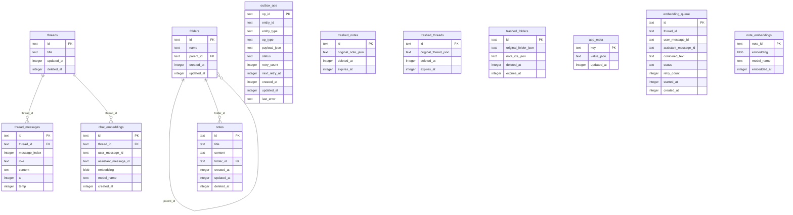
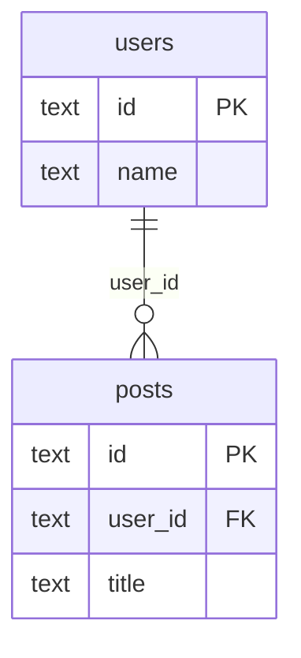

# SQLite 스키마 시각화

이 문서는 현재 앱의 주요 SQLite 테이블 구조를 문서용으로 단순화해 보여줍니다.

- 목적: 팀 내 공유, PR 리뷰, 신규 온보딩
- 기준 소스: [`packages/storage/src/sqlite-schema.ts`](/Users/johnhan/Development/GraphNode_Front/packages/storage/src/sqlite-schema.ts)
- 표기 원칙:
  - Mermaid ER의 실선 관계는 스키마상 FK가 있는 관계를 의미합니다.
  - 아래 "논리 연결" 섹션은 앱 레벨에서 연결하지만 스키마상 FK는 없는 관계입니다.

## ER 다이어그램

Mermaid 원본 파일:

- [`docs/schema.mmd`](/Users/johnhan/Development/GraphNode_Front/docs/schema.mmd)



## 논리 연결

아래 항목은 현재 앱에서 실제로 연결해서 사용하지만, 스키마상 FK로 강제되지는 않습니다.

- `embedding_queue.thread_id` -> `threads.id`
- `embedding_queue.user_message_id` -> `thread_messages.id`
- `embedding_queue.assistant_message_id` -> `thread_messages.id`
- `chat_embeddings.user_message_id` -> `thread_messages.id`
- `chat_embeddings.assistant_message_id` -> `thread_messages.id`
- `note_embeddings.note_id` -> `notes.id`
- `outbox_ops.entity_id` -> 엔티티 타입(`note`, `folder`, `thread`)에 따라 각 본문 테이블 row

## 구조 요약

### 본문 데이터

- `folders`
- `notes`
- `threads`
- `thread_messages`

앱의 source of truth 역할을 하는 기본 테이블입니다.

### 동기화/메타

- `outbox_ops`: 서버 동기화 대기 작업
- `app_meta`: 마이그레이션 상태, 런타임 메타데이터

### 휴지통

- `trashed_notes`
- `trashed_threads`
- `trashed_folders`

삭제 시점의 원본 JSON을 보관해 복구/만료 처리에 사용합니다.

### 임베딩 계층

- `embedding_queue`: 채팅 Q&A pair 임베딩 작업 큐
- `chat_embeddings`: 채팅 임베딩 저장소
- `note_embeddings`: 노트 임베딩 저장소

임베딩은 본문 테이블과 분리되어 저장됩니다. 이렇게 분리하면 일반 조회를 가볍게 유지할 수 있고, 모델 교체나 전체 재임베딩을 본문 데이터와 독립적으로 처리하기 쉽습니다.

## Mermaid 사용법

이 문서의 ER 다이어그램은 Mermaid `erDiagram` 문법으로 작성했습니다.

### 어디를 수정하면 되나

- 다이어그램 원본은 [`docs/schema.mmd`](/Users/johnhan/Development/GraphNode_Front/docs/schema.mmd)입니다.
- 이 문서의 Mermaid 블록은 문서 안에서 바로 보이도록 복사해둔 렌더용입니다.
- 실제 스키마 기준은 [`packages/storage/src/sqlite-schema.ts`](/Users/johnhan/Development/GraphNode_Front/packages/storage/src/sqlite-schema.ts)입니다.
- 테이블이 추가되거나 FK가 바뀌면 스키마와 이 문서를 함께 업데이트하는 것을 권장합니다.

### 기본 문법 예시



의미:

- `users { ... }`: 엔티티(테이블) 정의
- `PK`: primary key
- `FK`: foreign key
- `users ||--o{ posts`: 1 대 N 관계
- `"user_id"`: 관계 라벨

### 이 문서에서의 표기 규칙

- FK가 실제 스키마에 있을 때만 Mermaid 관계선으로 표시합니다.
- FK가 없는 앱 레벨 연결은 `논리 연결` 섹션에 텍스트로 적습니다.
- 컬럼 타입은 SQLite 관점에서 단순화해 `text`, `integer`, `blob` 정도만 표기합니다.

### 렌더링해서 보는 방법

1. Mermaid 지원 Markdown 뷰어에서 [`docs/schema.md`](/Users/johnhan/Development/GraphNode_Front/docs/schema.md)를 엽니다.
2. GitHub, 일부 문서 도구, Mermaid 지원 에디터에서는 코드 블록이 자동 렌더됩니다.
3. VS Code에서는 Mermaid 지원 Markdown Preview 확장을 사용하면 편합니다.

### SVG/PNG로 추출하는 방법

Mermaid CLI를 쓰면 이미지로 추출할 수 있습니다.

예시:

```bash
npx @mermaid-js/mermaid-cli -i docs/schema.mmd -o docs/schema.svg
```

PNG가 필요하면 확장자만 바꾸면 됩니다.

```bash
npx @mermaid-js/mermaid-cli -i docs/schema.mmd -o docs/schema.png
```

권장 워크플로우:

1. [`docs/schema.mmd`](/Users/johnhan/Development/GraphNode_Front/docs/schema.mmd)를 수정합니다.
2. 필요하면 [`docs/schema.md`](/Users/johnhan/Development/GraphNode_Front/docs/schema.md)의 렌더용 코드 블록도 같이 맞춥니다.
3. CLI로 `svg` 또는 `png`를 추출합니다.

### 운영 팁

- 테이블이 많아지면 한 장으로 보기 어렵기 때문에 `core schema`, `embedding schema`처럼 주제별로 분리하는 것이 좋습니다.
- Mermaid ER는 문서화와 리뷰에는 좋지만, FK가 없는 논리 관계를 자동 추론해주지는 않습니다.
- 실제 DB를 탐색할 때는 DBeaver 같은 툴과 병행하는 편이 가장 실용적입니다.

## 참고

- 임베딩 런타임 설명: [`docs/embedding-runtime.md`](/Users/johnhan/Development/GraphNode_Front/docs/embedding-runtime.md)
- SQLite 런타임 상태: [`docs/sqlite-runtime-status.md`](/Users/johnhan/Development/GraphNode_Front/docs/sqlite-runtime-status.md)
- 벡터 계층 메모: [`docs/sqlite-vector-migration.md`](/Users/johnhan/Development/GraphNode_Front/docs/sqlite-vector-migration.md)
- Mermaid 공식 문법: [Mermaid ER Diagram](https://mermaid.js.org/syntax/entityRelationshipDiagram.html)
